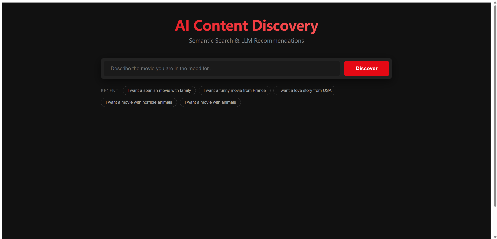
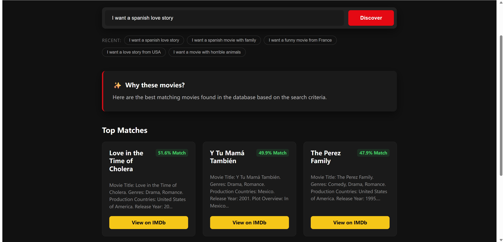

# Full-Stack AI Movie Recommendation System

A full-stack movie recommendation system built with **React**, **FastAPI**, and **LangChain**. The application combines Retrieval-Augmented Generation (RAG), semantic search, and movie metadata to provide personalized movie recommendations through a modern web interface.

This project covers the complete development process, including frontend development, backend APIs, vector database construction, automated testing, and Docker deployment.

---

## Demo

### Home Page

> Search movies using natural language.



---

### Recommendation Results

> Personalized recommendations generated by the RAG pipeline.



---

## Features

- Full-stack web application built with React and FastAPI
- AI-powered movie recommendations using Retrieval-Augmented Generation (RAG)
- Semantic search with ChromaDB
- RESTful API for frontend-backend communication
- Dockerized development and deployment
- Automated evaluation pipeline using PyTest

---

## Tech Stack

### Frontend

- React
- JavaScript (ES6)
- Vite
- CSS3

### Backend

- FastAPI
- Python 3.11
- Pydantic
- Uvicorn

### AI

- LangChain
- OpenAI API
- HuggingFace Embeddings (`all-MiniLM-L6-v2`)

### Database

- ChromaDB
- SQLite

### DevOps

- Docker
- Docker Compose
- Nginx

### Testing

- PyTest

---

## Project Structure

```text
LLM-MOVIE-RECOMMENDATION/
├── frontend/
│   ├── src/
│   ├── Dockerfile
│   └── package.json
│
├── app/
│   ├── llm_agent.py
│   ├── main.py
│   └── models.py
│
├── data/
│
├── evaluation/
│   ├── golden_dataset.json
│   └── test_pipeline.py
│
├── build_database.py
├── docker-compose.yml
├── Dockerfile
└── requirements.txt
```

---

## System Overview

The application consists of four main components.

### Frontend

The frontend is built with **React** and **Vite**. It provides a simple interface where users can search for movies using natural language and view AI-generated recommendations.

### Backend

The backend is developed with **FastAPI**, exposing RESTful APIs that connect the frontend with the recommendation engine.

### Recommendation Engine

Movie information is converted into vector embeddings and stored in **ChromaDB**. User queries are matched through semantic search, and the retrieved results are sent to an LLM through **LangChain** to generate personalized recommendations.

To improve retrieval quality, movie metadata such as genres, countries, and release years are combined with semantic embeddings during indexing.

### Deployment

The frontend and backend are containerized with Docker and orchestrated using Docker Compose, making the project easy to run locally.

---

## Highlights

### Full-stack architecture

Built a complete application with a React frontend communicating with a FastAPI backend through REST APIs.

### AI-powered recommendation

Implemented a Retrieval-Augmented Generation (RAG) pipeline combining semantic vector search and LLM reasoning.

### Dockerized deployment

Configured Docker Compose to run both frontend and backend services with a single command.

### Automated testing

Built a PyTest evaluation pipeline to validate recommendation quality before deployment.

---

## Getting Started

### Clone the repository

```bash
git clone https://github.com/your-username/LLM-movie-recommendation.git

cd LLM-movie-recommendation
```

### Configure the API key

Create a `.env` file in the project root.

```text
OPENAI_API_KEY=your-api-key
```

### Build the vector database

```bash
pip install -r requirements.txt

python build_database.py
```

### Run the application

```bash
docker-compose up --build
```

Frontend

```
http://localhost
```

Backend API documentation

```
http://localhost:8000/docs
```

##  Local Development (Without Docker)

If you want to run the project locally for development or debugging without Docker:

### 1. Start the Backend (FastAPI)

```bash
# Activate your virtual environment first
pip install -r requirements.txt
python -m uvicorn app.main:app --reload
```

The backend API will be available at:

```
http://localhost:8000
```

You can also access the interactive API documentation at:

```
http://localhost:8000/docs
```

---

### 2. Start the Frontend (React + Vite)

```bash
cd frontend
npm install
npm run dev
```

The frontend will be available at:

```
http://localhost:5173
```
---

## Running Tests

```bash
pytest evaluation/test_pipeline.py -s
```
